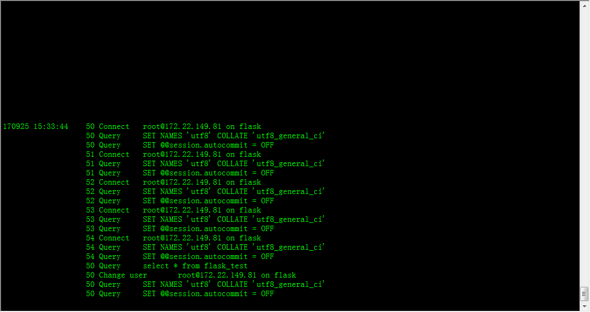
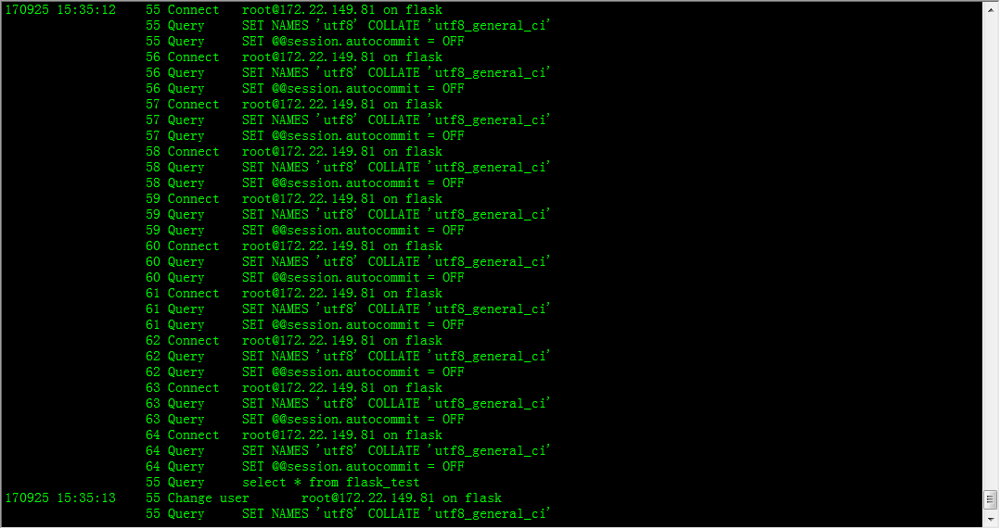

# Flask-pool-showcase

Flask-pool-showcase!

  - Flask version 0.12.2
  - run with db type mysql.
  - run with mysql pool=> [PyMysqlPool](https://github.com/LuciferJack/python-mysql-pool).

# 中文

  - 运行的Flask 版本是 0.12.2。
  - 运行的数据库类型是mysql。
  - 运行的数据库连接池是=>[PyMysqlPool](https://github.com/LuciferJack/python-mysql-pool)。

# img show
* use dynamic pool

* use fixed 10 sized pool

* use no pool(directly connect)

# vs Flask default mysql
* no pool effect and direct connected

